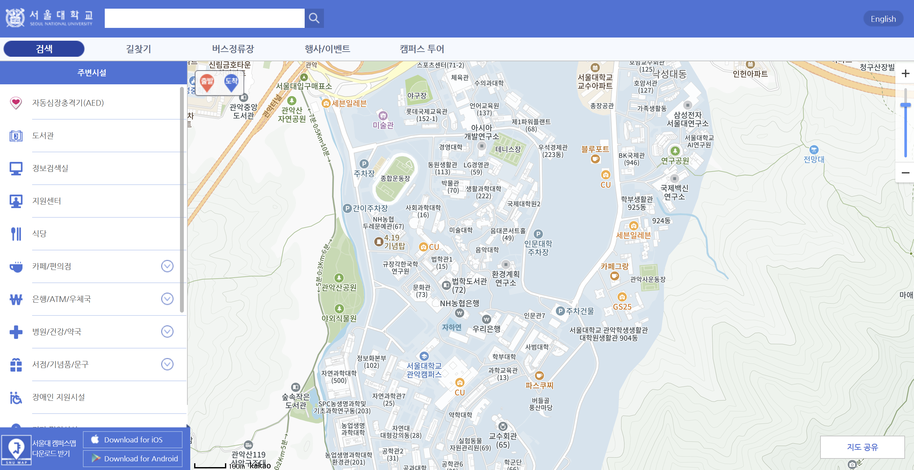
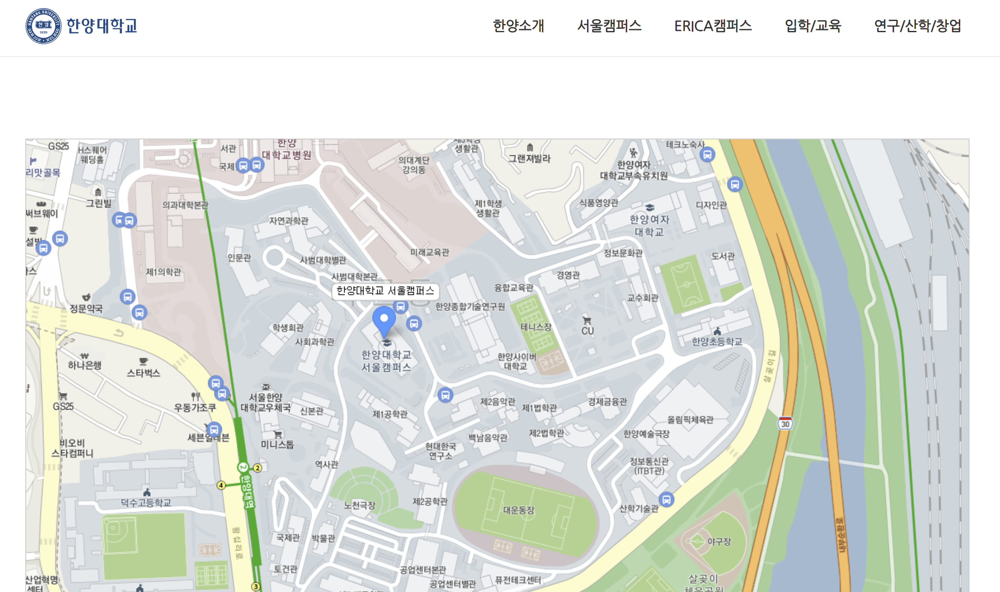

# JEIU Campus Explorer 3D: 재능대학교 3D 맵 기반 종합정보 제공 및 강의실 예약 플랫폼

## 1-1. 문제인식
### 1)학생
1. 우리 학교 건물 이름이 뭐가 무슨 건물인지 잘 모르겠다. ex> 봉사관, 재능관 등등..
2. 학교의 빈강의실을 사용할려면 어떤 절차를 통해 이용할 수 있는지 모른다.
3. 현재 진행중인 캠페인및 이벤트를 한눈에 확인하고싶다.
4. 학교 어느 건물에서 캠페인및 이벤트가 진행되고있는지 직관적으로 알고싶다.
  
## 1-2. 사용자 페르소나 (User Persona)

### 학생 페르소나

**천규진 (24세, 컴퓨터소프트웨어과 2학년)**
- **상황**: 동아리 활동과 팀 프로젝트 모임을 자주 갖습니다.
- **문제점**: 
  - 빈 강의실을 찾고 예약하는 절차가 복잡함
  - 건물 위치와 이름을 헷갈려 약속 장소를 찾기 어려움
  - 학교 행사 정보를 놓치는 경우가 많음
- **니즈**: 
  - 간편한 강의실 예약 시스템
  - 직관적인 캠퍼스 탐색 도구
  - 실시간 이벤트 정보 접근

### 총학생회 페르소나 [실제로 인터뷰하고 받아온 내용입니다.]

**채종호 (22세, 총학생회 체육부장)**
- **상황**: 다양한 학생 행사와 캠페인을 기획하고 홍보합니다.
- **문제점**:
  - 학생들의 행사 참여율 저조
  - 효과적인 홍보 채널 부족
- **니즈**:
  - 행사 정보를 효과적으로 알릴 수 있는 플랫폼
  - 학생들의 참여를 유도할 수 있는 직관적인 인터페이스
  
## 2. 프로젝트 목표
- 재능대학교 3D 맵 기반 직관적인 각 건물모습 제공 및 강의실 예약 플랫폼으로 학생들의 캠퍼스 시설의 접근성을 향상시키는 것
- 학교 및 총학생회의 캠페인 참여율을 높이고 홍보목적까지 두루 겸비하는것이 목표

## 3. 시장조사
- **서울대학교** - 캠퍼스 맵 솔루션을 통해 건물 정보 제공
- 
- **한양대학교** - 스마트 캠퍼스 시스템
- 
- **경희대학교** - 가상 캠퍼스 솔루션
  
- **재능대학교** - VR 캠퍼스: 학교 건물및 강의실 모습을 사진으로 파악 가능하다.  
    ㄴ> **대학생활(홈페이지)**: 현재는 재능대 온라인 예약 시스템이 "없고" 
    빌리려는 강의실 or 실습실마다 직접 각각 다른 담당자에게 문의 해야합니다.
  
## 4. POC단계의 목표
- **목표**: 3D 맵 기반 플랫폼의 **핵심 기능 구현 가능성 검증**
- **방향**: 최종 프로토타입 개발 전, **기술적 타당성 확보**

## 5. 필요 자원

### 5-1. 기술 스택
- **Frontend**: `JavaScript`, `Three.js`, `HTML`, `CSS`
  - **JavaScript:** 	웹에서 가장 보편적이고, React/Three.js 등 다양한 프레임워크와 호환 가능
  - **Three.js:** 	3D 캠퍼스 지도를 웹 브라우저 안에서 자연스럽게 구현 가능 
  - **HTML/CSS:** 표준 웹 기술로 UI/UX를 직관적이고 반응형으로 구현 가능
- **Backend**: `Node.js`, `Express`
  - **Node.js:** 이벤트 기반 비동기 처리에 강하고, 프론트엔드와 같은 언어(JavaScript)로 일관성 있는 개발 가능
  - **Express:** 간결하면서도 유연한 서버 프레임워크로, REST API 구현에 매우 적합함
- **Database**: `MariaDB`
  - **MariaDB:** 오픈소스이며 성능이 우수한 관계형 데이터베이스로, 예약 정보나 캠페인 데이터와 같은 정형 데이터를 처리하기에 적합
  
### 5-2. 샘플 데이터
- 캠퍼스 건물 정보 [교수님이 주신 컴소과 팜플렛 참조]
- 강의실 정보 [직접 우리학교 캠퍼스를 뛰어다니며 강의실을 건물마다 "직접" 찍어옴]
- 이벤트/캠페인 데이터 [재능대학교 공지사항 및 공식 인스타그램을 확인하며 "현재 진행중인" 데이터를 가져옴]

## 6. 역할 분배
- **공통업무:** 자료조사

- **박민호:** 아이디어 기획, 백엔드 보조(API),강의실 사진자료 수집, 발표자료 정리및 프로젝트 전반적인 발표
- **조상준:** 전반적인 백앤드및 모든 데이터베이스 설계, 역할 분담 기획, 디버깅 보조
- **박성빈:** 프론트엔드 보조및 백앤드 개발 보조
- **천규진:** 아이디어 기획, 전반적인 모든 프론트앤드 UI 구상및 개발작업, 프론트엔드 + 백엔드(API) + 데이터베이스 연결및 디버깅 작업, 발표 자료준비 +             프로젝트 발표 보조, 강의실 사진자료 수집, 페르소나를 위한 인터뷰

## 7. 프로젝트 구조

### 7-1. 프론트엔드
- **메인 페이지**: 3D 캠퍼스 맵과 이벤트 섹션
- **강의실 정보 페이지**: 건물별 강의실 상세 정보
- **예약 시스템**: 사용자 인터페이스와 폼

### 7-2. 백엔드
- **API 서버**: 강의실 정보 및 예약 관리
- **데이터베이스 연동**: 예약 정보 저장 및 조회

### 7-3. 데이터베이스 설계
- **rooms 테이블**: 건물 및 강의실 정보
- **reservations 테이블**: 예약 정보 (날짜, 시간, 학생 정보 ex> 학번 )
- **equipment 테이블**: 강의실 시설 정보

## 8. 시연 시나리오
1. **메인 페이지 접속**: 3D 캠퍼스 맵 소개
2. **건물 탐색**: 각 건물 정보 및 이벤트 확인
3. **강의실 예약 과정**: 강의실 선택 > 예약 정보 입력 > 예약 완료
4. **데이터베이스 저장 확인**: 예약 정보가 실제로 저장되는 것 시연

## 9. 구현된 주요 기능 [직접 웹페이지 시현과 함께]

### 9-1. 3D 캠퍼스 맵
- **인터랙티브 3D 모델링**: 7개 주요 건물(재능관, 혁신관, 자율관 등) 구현
- **직관적인 탐색**: 건물 마우스 오버 시 크기 변화 효과
- **건물 정보 팝업**: 건물 클릭 시 상세정보 제공

### 9-2. 이벤트 및 캠페인 통합
- **건물별 진행 이벤트**: 각 건물에서 진행 중인 이벤트 정보 표시
- **이벤트 링크**: 상세 페이지로 연결되는 링크 제공
- **이벤트 갤러리**: 전체 이벤트 및 캠페인 모아보기

### 9-3. 강의실 예약 시스템
- **강의실 정보 제공**: 수용 인원, 시설 정보, 이미지 갤러리
- **예약 시스템**: 날짜/시간 선택, 학생 인증, 예약 확인
- **실시간 데이터베이스 연동**: 예약 정보 저장 및 관리

## 10. 위험 요소 및 대응 전략

| 위험 요소 | 대응 방안 |
|-----------|-----------|
| 3D 렌더링 성능 저하 | 모델 단순화 및 최적화 기술 적용 |
| 브라우저 호환성 문제 | 주요 브라우저 테스트 및 폴백 준비 |
| 일정 지연 | 핵심 기능 우선, MVP 중심 개발 및 템플릿 활용 |

## 11. 차후 개발 방향
- 지형적 높낮이와 건물의 디테일을 살리는 방향
- 실시간으로 진행중인 이벤트와 연동 할수있는 컨텐츠 제작
- 유저 친화적으로 UI 개선 및 사용자 의견 수렴
- **예약 승인 시스템**: 관리자 승인 프로세스 구현
- **모바일 최적화**: 반응형 디자인 개선
- **사용자 계정 시스템**: 로그인 및 개인화된 예약 관리