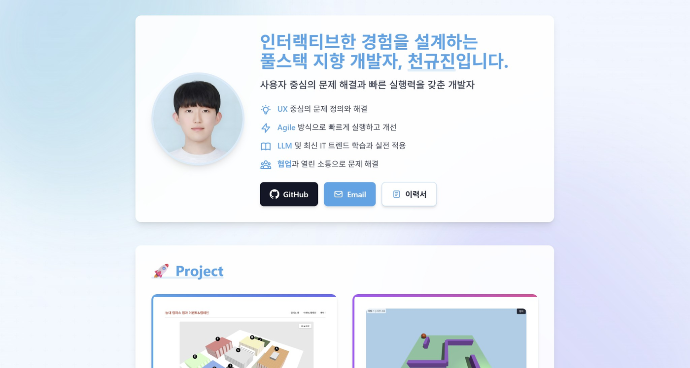
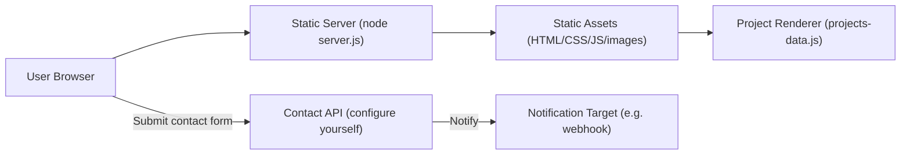

# Portfolio Web

정적 HTML 기반의 **개인 포트폴리오 사이트**입니다. `projects-data.js`의 데이터만 수정하면 프로젝트 카드/모달이 자동 생성되며, Three.js 데모와 Unity WebGL 데모를 같은 사이트에서 제공합니다.

- **레포 유형**: 개인 프로젝트
- **기간**: 2025.05 ~ 현재
- **핵심 가치**: “정적 사이트 + 데이터 기반 렌더링”으로 프로젝트/자료/데모를 한 곳에서 재현 가능하게 제공

## 데모

- **스크린샷**

  

- **라이브 데모**: (선택) 배포 URL을 여기에 추가하세요.

## 문제 정의(Why) / 목표(Goal)

- **Why**: 링크/문서가 흩어진 프로젝트들을 “한 페이지”에서 빠르게 훑고, 필요하면 데모까지 실행할 수 있게 만들기 위함입니다.
- **Goal**: (1) 프로젝트 목록을 데이터로 관리 (2) 모달로 상세 정보를 구조화 (3) WebGL/3D 데모를 **로컬에서 재현 가능**하게 제공.

## 주요 기능(Features)

- **프로젝트 카드/모달 자동 생성**: `js/projects-data.js` → `js/projects-renderer.js`
- **Three.js 데모 포함**: 3D 미로 데모 소스 포함 (`Projects/3D_Maze/maze-game.js`)
- **Unity WebGL 데모 포함**: WebGL 빌드 포함 (`Projects/Bullet_Game/Build/`)
- **이미지/비디오/PDF 뷰어**: 프로젝트 자료를 모달에서 열람 (PDF는 `pdfPath` 설정 시)
- **반응형 UI + 애니메이션**: 스크롤/카드 등장 효과 (`js/animations.js`, `js/main.js`)
- **연락처 폼(선택)**: 외부 엔드포인트로 전송하는 폼(기본은 **직접 설정 필요**, 아래 참고)

## 기술 스택

- **Frontend**: HTML, CSS, Vanilla JavaScript, Tailwind CSS(CDN)
- **Backend(로컬 서빙용)**: Node.js (`server.js` 정적 서버)
- **DB**: 없음 (정적 데이터)
- **Infra/Deploy**: 선택(정적 호스팅 가능). Unity WebGL은 `wasm`/`data` MIME 처리가 필요
- **외부 API/연동**: (선택) 연락처 폼 전송용 API

## 시스템 구성도(Architecture)



## 빠른 시작(Quick Start)

### 요구사항

- Node.js **18+**

### 로컬 실행

> 파일 프로토콜(`file://`)로 열면 Unity WebGL(및 일부 리소스)이 정상 동작하지 않을 수 있습니다. 아래 서버로 실행하세요.

```bash
node server.js
```

브라우저에서 접속:

- `http://localhost:8000`

### (옵션) 연락처 폼 설정/비활성화

이 레포의 연락처 폼은 **외부 API 엔드포인트가 필요**합니다. 로컬 재현 시 아래 중 하나를 선택하세요.

- **설정**: `js/main.js`의 `fetch('...')` URL을 본인 엔드포인트로 교체
- **비활성화**: `js/main.js`에서 `contactForm` submit 핸들러를 제거(또는 early return 추가)

### Docker 실행

- 이 레포는 Docker 구성이 없습니다.

### 테스트

- 별도 테스트 스크립트가 없습니다.

## 환경변수(.env.example)

> 이 레포는 런타임에 `.env`를 읽지 않습니다. 아래는 **선택적인 커스텀을 위한 키 이름 예시**이며, 적용하려면 코드 수정 또는 빌드 단계가 필요합니다.

| Key | 설명 | 예시(가짜 값) |
| --- | --- | --- |
| CONTACT_API_URL | 연락처 폼 POST 엔드포인트 | `https://example.invalid/contact` |

## 폴더 구조(간단)

- `index.html` : 메인 페이지
- `css/styles.css` : 스타일
- `js/projects-data.js` : 프로젝트 데이터(카드/모달 원본)
- `js/projects-renderer.js` : 카드/모달 렌더러(테마/특수 콘텐츠 포함)
- `js/animations.js` : 애니메이션
- `js/main.js` : UI 동작 + (선택) 연락처 폼 제출
- `Projects/` : 데모/자료 모음
  - `3D_Maze/` : Three.js 데모
  - `Bullet_Game/` : Unity WebGL 빌드
- `server.js` : 정적 서버(특히 Unity WebGL용)

## 콘텐츠 수정(프로젝트 추가/수정)

- **프로젝트 추가/수정**: `js/projects-data.js`의 `projectsData` 배열을 편집
- **렌더링/테마**: `js/projects-renderer.js`에서 카드/모달 UI와 색상 테마를 관리
- **사용 가능한 `colorTheme` 키**: `sky`, `indigo`, `purple`, `pink`, `emerald`, `amber`, `blue`, `teal`

## 내 기여

- **개인 프로젝트(전체)**
- **설계/개발**: 단일 페이지 구성, 데이터 기반 렌더링, 모달 UI/UX, 데모(Three.js/Unity) 통합
- **재현성 확보**: 로컬 정적 서버(`server.js`)로 WebGL 리소스 서빙

## 트러블슈팅/의사결정

- **왜 `server.js`를 두었나**: Unity WebGL은 `wasm`/`data`를 올바른 헤더로 서빙해야 하며, `file://` 환경에서는 깨질 수 있어 로컬 서버 실행을 기본으로 했습니다.
- **왜 데이터 파일 분리(`projects-data.js`)**: 카드/모달을 HTML에 하드코딩하지 않고, 데이터 수정만으로 UI가 갱신되도록 유지보수 비용을 줄였습니다.
- **연락처 폼은 왜 “선택”인가**: 외부 엔드포인트/웹훅 등은 배포 환경마다 다르고 민감 정보가 포함될 수 있어, 레포에는 고정 값(실서버)을 문서로 노출하지 않도록 했습니다.

## TODO / 향후 개선 사항

- [ ] 연락처 폼 엔드포인트를 코드 상수 대신 설정 기반(예: 빌드 타임 치환)으로 전환
- [ ] `.env.example` 및 로컬 모의 API(옵션) 제공
- [ ] 정적 호스팅용(WebGL 포함) 권장 헤더 설정 예시 추가
- [ ] 프로젝트 데이터 스키마(필드/타입) 문서화 및 유효성 검사(런타임/빌드타임) 추가
- [ ] 접근성(키보드 내비게이션/포커스 트랩/ARIA) 점검 및 개선
- [ ] 이미지/비디오 리소스 최적화(용량/해상도) 및 캐시 정책 정리
- [ ] 린트/포맷터(ESLint/Prettier) 도입 및 CI에서 체크
- [ ] `server.js`에 보안/편의 옵션(캐시 헤더, 디렉터리 트래버설 방지) 강화
